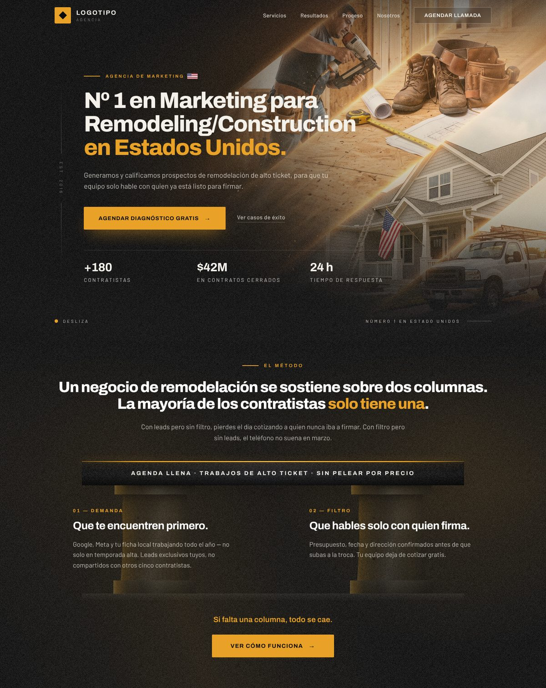
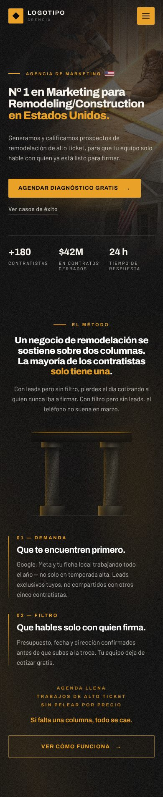

# Arquitetura, lógica e design do site

Landing page de uma **agência de marketing para contratistas de remodelação/construção nos EUA**.
Copy em **espanhol** (público hispânico). Proposta: gerar e *filtrar* leads de alto ticket para que
o contratista só fale com quem está pronto para fechar.

O projeto foi exportado de uma ferramenta de design (runtime **dc**). As páginas não são HTML
estático comum: o template fica dentro de `<x-dc>` e é montado no navegador por `support.js` com React.



---

## 1. Mapa de arquivos

| Arquivo | Papel | Status |
|---|---|---|
| `index.html` | Página principal: header, hero e segunda dobra "El Método" | **Produção** |
| `Landing Contratistas (backup - hero 64svh).dc.html` | Cópia idêntica do index, só muda a altura do hero (`64svh` em vez de `72svh`, linha 22) | Backup |
| `Segunda Dobra - Dos Columnas.dc.html` | Canvas de exploração com as variantes da segunda dobra (rodadas t1–t5) | Rascunho/design |
| `snippets/transicao-hero.html` | Faixa de transição mascarada (92px) entre hero e segunda dobra, removida em 28/07/2026 e guardada para reuso | Guardado |
| `support.js` | Runtime dc (gerado de `dc-runtime/src/*.ts`, não editar) | **Produção** |
| `image-slot.js` | Web component `<image-slot>` do editor; é carregado no index mas **não é usado** | Sobra |
| `grain.png` | Tile de ruído 256×256 da textura da casa | **Produção** |
| `uploads/Gemini_Generated_Image_….png` | Colagem do hero (2752×1536, 7,1 MB) | **Produção** |
| `uploads/pasted-1785214114686-0.png` | Mockup mobile com setas desenhadas sobre as colunas (feedback) | Referência |
| `uploads/pasted-1785215085821-0.png` | Pacote de setas desenhadas **com marca d'água Shutterstock** | Referência — não usar |
| `uploads/captura-atual.png` | Captura de uma faixa de transição trapezoidal | Referência |
| `uploads/coluna_ionica.svg`, `uploads/vectorizer-….svg` | Tentativas de coluna vetorizada | Rascunho |
| `.thumbnail` | Prévia WebP 640×398 gerada pelo editor | Metadado |
| `CLAUDE.md` | Regras persistentes de design do projeto | Documentação |

---

## 2. Como rodar e publicar

```bash
python3 -m http.server 8000   # ou qualquer servidor estático
# abrir http://localhost:8000/
```

- **Precisa de servidor HTTP.** Em `file://` o reparse do template (`fetch(location.href)`, `support.js:159`) falha.
- **Precisa de rede:** React e ReactDOM 18.3.1 vêm do unpkg com SRI (`support.js:1143-1146`) e as fontes do
  Google Fonts. Se o CDN falhar, a página fica **em branco**, porque o `<x-dc>` já foi escondido (`support.js:1906-1909`).
- Funciona em qualquer hospedagem estática. **Publicado em GitHub Pages:** https://mynewacnsj.github.io/teste/
  (branch `gh-pages`, espelho do branch de desenvolvimento; `.nojekyll` evita o processamento Jekyll dos `{{ }}`).
- Se houver CSP, libere `'unsafe-eval'` (o runtime usa `new Function`), `https://unpkg.com` e estilos inline.

---

## 3. Runtime dc (`support.js`)

**Boot:** esconde `<x-dc>` → carrega React UMD → lê o template de `<x-dc>`, a lógica de
`<script type="text/x-dc" data-dc-script>` e as props de `data-props` → troca `<x-dc>` por
`<div id="dc-root">` → renderiza com `createRoot`. Em produção as props valem o `default` de cada uma.

**Estrutura de uma página:**

```html
<script src="./support.js"></script>
<x-dc>
  <helmet data-dc-atomics="">…fontes, scripts, <style> base…</helmet>
  …template…
</x-dc>
<script type="text/x-dc" data-dc-script data-props="{…}">
class Component extends DCLogic { renderVals() { return {…} } }
</script>
```

**Linguagem de template:**

| Sintaxe | Uso |
|---|---|
| `{{ caminho.a[0] }}` | Interpolação; aceita `!`, `==`, `===`, literais. Sem ternário, aritmética, `&&`/`||` ou chamadas — isso vai em `renderVals()` |
| `<sc-if value="{{ flag }}" hint-placeholder-val="{{ true }}">` | Condicional (não existe `sc-else`). O `hint` é só o valor de preview no editor |
| `<sc-for list="{{ items }}" as="it">` | Loop (`$index` disponível) |
| `onClick="{{ fn }}"`, `aria-expanded="{{ x }}"` | Eventos e atributos ligados |
| `style-hover="…"` | Estilo de hover (vira classe gerada com `!important`) |
| `<helmet data-dc-atomics>` | Injeta no `<head>` (scripts/links uma vez, `<style>` vivo) + classes utilitárias |
| `<dc-import>`, `<x-import>` | Componentes externos (não usados neste projeto) |

**Lógica:** classe `Component extends DCLogic`, API estilo React de classe (`this.props`, `this.state`,
`setState`, `componentDidMount/DidUpdate/WillUnmount`). `renderVals()` devolve as variáveis do template.
O script não passa por Babel: tem de ser JS puro, sem JSX.

**Limitação importante:** o runtime **não interpola `{{ }}` dentro de `style="…"`**. Por isso todo
valor dinâmico de estilo (opacidades, alturas, transforms) é aplicado direto no DOM por métodos `_paint()`,
usando atributos-gancho `data-av-*`.

---

## 4. Página principal (`index.html`)



### 4.1 Hero (linhas 22–158)

Raiz `[data-av-root]`: `min-height:min(100svh, calc(72svh + 34vw))`, `padding-top:clamp(72px,9vh,104px)`.

**Camadas de fundo (de baixo para cima):**
1. `` da colagem com `object-fit:cover; object-position:68% 50%` (27) — o foco fica à direita, o texto à esquerda.
2. Scrim horizontal escuro, em três intensidades (`scrimSoft/Medium/Heavy`, 30–38).
3. Fade vertical para `#0c0c0d` e brilho âmbar radial (40–41).
4. Scrim extra no mobile (`isNarrow`, 43–45).
5. Grão + hachura 135° (47–48) e vinheta (49).

**Header fixo** (51–95): camada de chrome com blur que aparece quando a página rola; logo (quadrado âmbar ◆ +
"Logotipo / Agencia"); nav desktop *Servicios · Resultados · Proceso · Nosotros* + CTA ghost "Agendar llamada";
no mobile, hambúrguer âmbar que vira X e abre um menu com os mesmos links e CTA sólido.

**Conteúdo** (97–142):
- Rail vertical "Est. 2016" (≥1180px).
- Eyebrow: traço âmbar + "AGENCIA DE MARKETING" + bandeira dos EUA em CSS.
- **H1:** "Nº 1 en Marketing para / Remodeling/Construction / *en Estados Unidos.*" (destaque âmbar), Archivo 800, `min(6.9vw,6.6vh,84px)`.
- Subtítulo: "Generamos y calificamos prospectos de remodelación de alto ticket, para que tu equipo solo hable con quien ya está listo para firmar."
- CTA primário "Agendar diagnóstico gratis →" (âmbar sólido) e secundário "Ver casos de éxito".
- Trust bar: **+180** Contratistas · **$42M** En contratos cerrados · **24 h** Tiempo de respuesta.

**Rodapé do hero** (144–157): "Desliza" (scroll cue, ≥760px) e "NÚMERO 1 EN ESTADO UNIDOS" (≥640px).

### 4.2 Carrossel de vídeos (topo da segunda dobra)

Primeiro elemento da segunda dobra, em largura total (`[data-av-reel]`).

- **6 vídeos Wistia** (lista `REEL` no script): `u3z5opwfg5`, `qtq97pqw42`, `85xxi41ehr`, `myhu1aftp6`,
  `j9kq9ph7rs`, `vwcc31ysmm`. Os posters vêm do próprio Wistia (`embed-ssl.wistia.com/deliveries/…?image_crop_resized=540x960`).
- **Cards = players Wistia reais.** Cada card tem um `<wistia-player>` criado por `_mountReel()` dentro de
  `[data-av-reel-slot]` (fora do React; o template cru não pode ter `<wistia-player>`). Sem atributos extras:
  a aparência vem da configuração no Wistia — plugin *video thumbnail* (prévia silenciosa em loop dos primeiros
  5–7s), *click for sound*, play grande e cor `#e9a227`, sem barra/volume/tela cheia.
  Uma camada transparente `.av-reel-hit` por cima captura o clique e abre o popup; o poster do Wistia
  (`style="{{ it.bg }}"`) fica por baixo enquanto o player carrega.
- **Loop infinito sem pausa:** 2 grupos idênticos de 6 cards; cada grupo anima `translateX(0 → -100%)` da
  própria largura (`@keyframes av-reel`), então a emenda é exata em pixel. Velocidade moderada:
  30s por volta no mobile (~36 px/s), 40s no desktop (~40 px/s). Não pausa no hover.
- **Tamanho:** mobile = 2 vídeos por linha (`(100vw - 52px) / 2`, 169px em 390px); desktop =
  `max(clamp(200px,17vw,300px), 100vw/6 - 20px)` (garante 1 grupo ≥ largura da tela). Cards sem sombra.
- **Degradê das bordas:** `mask-image` horizontal no `.av-reel` (curva ease-out em 9 paradas, largura
  `--av-reel-fade: clamp(44px,13vw,260px)`), mobile e desktop. É máscara e não camada pintada: os cards
  se dissolvem no próprio fundo da seção (grão, hachura e brilho âmbar), sem emenda de cor.
- **Acessibilidade:** só o 1º grupo é focável (botões com `aria-label "Reproducir video N de 6"`);
  a cópia tem `aria-hidden` e `tabindex=-1`. Com `prefers-reduced-motion` a faixa para e vira rolagem manual.
- **Popup** (`[data-av-vmodal]`, fora da `<section>`): moldura 9:16 centrada (não é tela cheia),
  altura máx. `min(100svh - 152px, 880px)`, filete âmbar de 2px no topo, véu escuro com blur + grão + hachura,
  poster desfocado e spinner enquanto o player carrega.
  - Abrir: `_openVideo(i)` → `state.video` → `_syncVideo()` cria `<wistia-player media-id autoplay player-color="e9a227">`
    no `[data-av-vmount]`, trava o scroll do `<html>` e foca o botão "Cerrar video".
  - Fechar: Esc, clique no véu ou no ×. Pausa, destrói o player após o fade (360ms), destrava o scroll e devolve o foco ao card.
  - O template usa `data-state="{{ videoState }}"` (atributo inteiro é reativo) e `style="{{ objeto }}"` para os posters:
    nunca `src="{{ … }}"` em ``, porque o navegador baixaria o texto literal do template cru.
- Scripts do Wistia (`player.js` + 6 `embed/<id>.js`) entram pelo `<helmet>`, assíncronos.
- Autoplay com som funciona após o clique no Chrome; se um navegador bloquear, o Wistia mostra o botão de play.

### 4.3 Segunda dobra "El Método"

Metáfora central: **o negócio é um pórtico sustentado por duas colunas — Demanda e Filtro**.

- **H2:** "Un negocio de remodelación se sostiene sobre dos columnas. La mayoría de los contratistas *solo tiene una*."
- Texto: "Con leads pero sin filtro, pierdes el día cotizando a quien nunca iba a firmar. Con filtro pero sin leads, el teléfono no suena en marzo."

**Desktop (`isWide`, ≥760px)** — corresponde à variante **3a** do canvas:
- Viga/lintel escura com friso âmbar de 3px: "Agenda llena · Trabajos de alto ticket · Sin pelear por precio".
- Grid de 2 colunas, cada uma com um **pilar de concreto** desenhado em CSS atrás do texto (opacidade `pillarOpacity`):
  - **01 — Demanda** · "Que te encuentren primero." · Google, Meta y tu ficha local… leads exclusivos.
  - **02 — Filtro** · "Que hables solo con quien firma." · Presupuesto, fecha y dirección confirmados…
- Soleira, tagline "Si falta una columna, todo se cae." e CTA âmbar sólido "Ver cómo funciona →".
- Setas desenhadas que se revelam no scroll (só ≥1360px).

**Mobile (`isNarrow`, <760px)** — corresponde à variante **3b**:
- Pórtico miniatura 240×200 (opacidade ≈ `pillarOpacity × 1.5`), setas animadas, cartões com filete âmbar à esquerda,
  os três benefícios empilhados, tagline e CTA em **contorno** largura total.

### 4.4 Lógica (`data-dc-script`, linhas 358–552)

**Props editáveis (`data-props`):**

| Prop | Padrão | Efeito |
|---|---|---|
| `scrimIntensity` | `medium` | Intensidade do escurecimento do hero (`soft`/`medium`/`heavy`) |
| `showTrustBar` | `true` | Mostra a faixa de números |
| `showScrollCue` | `true` | Mostra "Desliza" (só ≥760px) |
| `showNavCta` | `true` | Mostra o CTA da nav |
| `showPillars` | `true` | Pilares desktop e pórtico mobile |
| `pillarOpacity` | `0.28` (0.08–0.45) | Opacidade dos pilares |
| `showTagline` | `true` | "Si falta una columna, todo se cae." |
| `showArrows` | `true` | Setas (mobile <760px e desktop ≥1360px) |
| `arrowsAnimated` | `true` | Revelação animada das setas; `false` = estáticas |

**Breakpoints** (medidos na largura do próprio `[data-av-root]` via `ResizeObserver`, nunca `window.innerWidth`):

| Largura | Muda |
|---|---|
| < 640 | some a nota "Número 1…" |
| < 760 | layout mobile da segunda dobra, scrim extra, sem scroll cue |
| < 900 | hambúrguer no lugar da nav |
| ≥ 1180 | rail "Est. 2016" |
| ≥ 1360 | setas no desktop |

**Comportamentos:**
- **Header "stuck":** um `IntersectionObserver` observa `[data-av-sentinel]` (60px do topo). Ao rolar, o chrome
  ganha fundo e a barra encolhe de `clamp(72px,9vh,104px)` para `clamp(56px,7vh,74px)`.
- **Menu mobile:** `toggleMenu` alterna `menuOpen`; `_paint` anima `max-height`, opacidade, translateY e as barras do hambúrguer em X. Fecha sozinho ao passar de 900px.
- **Textura adaptativa:** `_paint` ajusta grão/hachura (mobile .075/.13, desktop .115/.2).
- **Setas:** revelam-se uma única vez via `clip-path` (.62s, segunda seta com 0.14s de atraso) quando entram a 86% do viewport.
- **Robustez:** `_repaint` pinta agora e no próximo frame (um remount de `sc-if` restaura o estilo estático); um poll de 100ms tenta ligar os observers por até 120 tentativas.

---

## 5. Canvas de variantes (`Segunda Dobra - Dos Columnas.dc.html`)

Documento em modo canvas (`<meta name="design_doc_mode" content="canvas">`) com o histórico de iterações,
da rodada mais nova para a mais antiga. Cada variante é um cartão com âncora (`#3a`) e cada rodada termina com
notas "Probar: …".

| Rodada | Proposta | Variantes |
|---|---|---|
| t1 | Duas colunas sustentando uma **viga âmbar sólida**, CTA contorno | 1a desktop, 1b mobile |
| t2 | Lintel de concreto escuro, pilares encurtados, âmbar só no CTA | 2a desktop, 2b mobile |
| **t3** | **Acabamento — pilares mais presentes, pórtico no mobile** (adotada no index) | **3a** desktop, **3b** mobile |
| t4 | Mobile: pórtico "habitado" — cartões dentro da estrutura | 4a |
| t5 | Mobile: pórtico compacto, objeto fechado, pilares grossos | 5a |

Script próprio mínimo: props `showPillars`, `pillarOpacity`, `showTagline`; `_paint` aplica a opacidade
em cada tipo de pilar (`data-av-portal5`, `portal`, `portico`, `pillar`, `pillarm`) com multiplicadores diferentes.

---

## 6. Faixa de transição (`snippets/transicao-hero.html`)

Entalhe de 92px em que a segunda dobra "sobe" sobre o fim do hero com silhueta de frontão/lintel (desktop) ou
platô (mobile), recortado por **máscara SVG em data URI**. Para recolocar:
1. Colar os dois `<sc-if>` como primeiros filhos da `<section>` da segunda dobra.
2. Voltar o wrapper de luz da seção de `inset:0` para `top:-92px` (continuidade de fase da textura).
3. Reduzir o `padding-top` da seção.

Regras: `margin-top:-92px` (sobrepõe sem somar altura), `overflow:hidden` obrigatório (senão as camadas de
3000px esticam o scroll), maiúsculas do SVG percent-codificadas e nada de `;` no data URI.

---

## 7. Sistema de design

**Paleta**

| Token | Valor |
|---|---|
| Fundo escuro | `#0c0c0d` |
| Fundo claro / texto sobre escuro | `#f4f1ea` |
| Texto escuro | `#16171a` |
| Âmbar | `#e9a227` (hover `#f6bc4d`) |
| Âmbar sobre claro | `#c98a12` |
| Cartões | `#ffffff`, borda `rgba(22,23,26,.09)`, raio 4px |
| Botões | raio 2px |

**Tipografia:** Archivo 500–800 (títulos, rótulos, números; eyebrows em caixa alta com tracking largo
`.28em`–`.36em`) e Barlow 400–600 (corpo). Tamanhos fluidos com `clamp()`/`min()` combinando `vw` e `vh`.

**Layout:** container `width:max(80%, min(100% - 2 * clamp(20px, 5vw, 88px), 1100px)); margin:0 auto`.
Medida de leitura: headline até 1060px, parágrafos 660–720px.

**Textura da casa** (todo fundo sólido): duas camadas absolutas filhas do elemento com a cor, nesta ordem:
1. Grão `url(./grain.png)` 256px em repeat.
2. Hachura `repeating-linear-gradient(135deg, <linha> 0 1px, transparent 1px 4px)`.

| Fundo | Grão | Hachura |
|---|---|---|
| Escuro | `opacity:.13`, `mix-blend-mode:screen` | `rgba(255,255,255,.055)` a `opacity:.22` |
| Claro | `opacity:.085`, `multiply` | `rgba(22,23,26,.021)` |

**Material "concreto" dos pilares:** gradiente cinza quente com realce âmbar no lado iluminado, poros com três
`radial-gradient` em tamanhos primos, juntas horizontais por `repeating-linear-gradient`, furos de forma,
grão em `multiply` e contorno levemente irregular com `clip-path: polygon(…)`.

**Linguagem visual:** escuro, quente e "de obra" — preto granulado, luz âmbar de fim de tarde, fotos de canteiro,
arquitetura (pórtico, lintel, colunas) como metáfora do método.

---

## 8. Pontos de atenção

1. **Erro de copy:** "NÚMERO 1 EN ESTADO UNIDOS" (`index.html:153`) → deveria ser "ESTADOS UNIDOS".
2. **Imagem do hero com 7,1 MB** (PNG 2752×1536) sem `srcset`/WebP: maior gargalo de carregamento (LCP). Converter para WebP/AVIF ~1600–2000px e renomear o arquivo.
3. **`image-slot.js` (65 KB) carregado sem uso** no `<head>` (`index.html:14`) — pode ser removido.
4. **Dependência de CDN:** sem unpkg a página fica em branco. Para produção, considere hospedar o React localmente (`window.__resources`) ou pré-renderizar.
5. **Textura da segunda dobra diverge do CLAUDE.md:** estático .1/.18 e `_paint` .115/.2 (regra pede .13/.22); `[data-av-tex]` (`index.html:407`) não existe no HTML — código morto.
6. **Faixa de transição** citada no CLAUDE.md como aplicada foi removida do index; só existe em `snippets/`.
7. **Links ainda são `href="#"`** (nav, CTAs) — falta ligar a agendamento/âncoras reais.
8. **Logo é placeholder** ("Logotipo / Agencia").
9. **Referência com marca d'água Shutterstock** em `uploads/` — não usar em produção.
